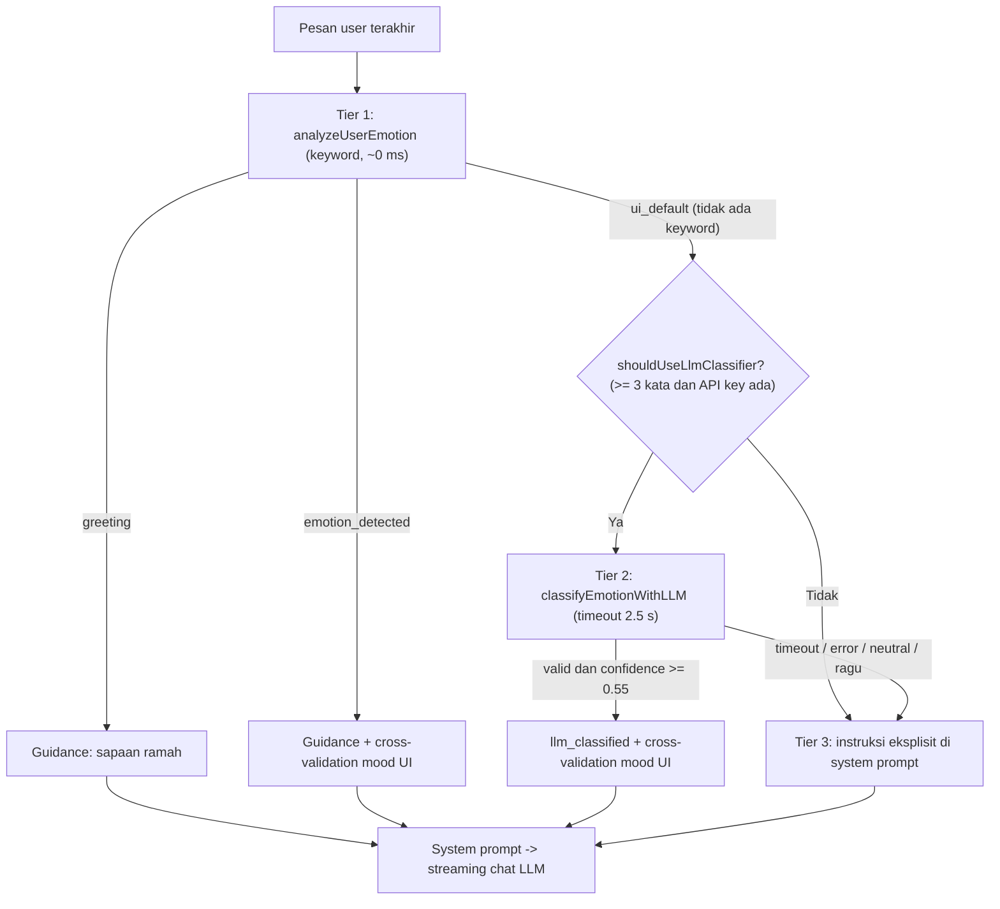

# Laporan Pengerjaan — AI Chatbot: Vocabulary Bank & Hybrid Emotion Detection

| Item | Keterangan |
| :--- | :--- |
| **Proyek** | PodoFriend — Anti-Burnout Focus & Study Companion |
| **Area** | Frontend Nitro Server — `server/api/ai/` & `server/utils/` |
| **Tanggal** | 4 Oktober 2026 |
| **Status** | Selesai & lolos `pnpm typecheck` — classifier LLM belum diuji dengan API key asli |

---

## Daftar Isi

1. [Ringkasan Eksekutif](#1-ringkasan-eksekutif)
2. [Kondisi Awal (Sebelum Perubahan)](#2-kondisi-awal-sebelum-perubahan)
3. [Task 0 — Ekspansi Keyword Energetic](#3-task-0--ekspansi-keyword-energetic)
4. [Task 1 — Modularisasi Vocabulary Bank](#4-task-1--modularisasi-vocabulary-bank)
5. [Task 2 — Hybrid Emotion Detection](#5-task-2--hybrid-emotion-detection)
6. [Bug yang Ikut Diperbaiki](#6-bug-yang-ikut-diperbaiki)
7. [Referensi API Fungsi](#7-referensi-api-fungsi)
8. [Konfigurasi Environment](#8-konfigurasi-environment)
9. [Pengujian](#9-pengujian)
10. [Daftar File yang Berubah](#10-daftar-file-yang-berubah)
11. [Panduan Kontribusi Keyword](#11-panduan-kontribusi-keyword)
12. [Known Issues & Rekomendasi Lanjutan](#12-known-issues--rekomendasi-lanjutan)

---

## 1. Ringkasan Eksekutif

Pekerjaan ini fokus pada **lapisan "kecerdasan emosional" PodoFriend**, yaitu cara server Nitro membaca perasaan pengguna sebelum LLM membalas. Ada tiga hasil utama:

| # | Pekerjaan | Hasil |
| :--- | :--- | :--- |
| 0 | Ekspansi keyword **Energetic** | Bertambah dari ~37 menjadi **200 keyword** dalam 5 sub-kategori |
| 1 | **Modularisasi** Vocabulary Bank | Data dipisah per emosi di `server/utils/vocab/`. `vocabularyBank.ts` turun dari 329 menjadi 186 baris dan hanya berisi logika |
| 2 | **Hybrid Emotion Detection** | Deteksi 3 tingkat: keyword (instan) → LLM classifier → instruksi eksplisit di prompt |
| + | Perbaikan bug | 3 bug ikut diperbaiki, termasuk cross-validation mood UI yang selama ini **tidak pernah berfungsi** |

---

## 2. Kondisi Awal (Sebelum Perubahan)

- Seluruh data kosakata (6 kategori) dan logika analisis ada dalam **satu file** `server/utils/vocabularyBank.ts`.
- Deteksi emosi **murni berbasis aturan (rule-based keyword matching)**:
  - kata tunggal cocok = skor `+1`
  - frasa (mengandung spasi) cocok = skor `+2`
  - kategori dengan skor tertinggi menang
- **Belum ada embedding maupun LLM classifier.** LLM (`gemini-3.8-flash` via 9Router) hanya bertugas membuat balasan chat.
- Kalau tidak ada keyword yang cocok, sistem langsung memakai mood UI tanpa analisis tambahan, sehingga pesan bernuansa (sarkasme, metafora, kalimat tanpa kata kunci) tidak terbaca.

---

## 3. Task 0 — Ekspansi Keyword Energetic

Menambahkan 200 keyword deteksi **Energetic** dalam 5 kelompok:

| Kelompok | Contoh Keyword |
| :--- | :--- |
| 1. Hype & Semangat Membara | `semangat 45`, `on fire`, `menyala`, `menggebu-gebu`, `auranya positif` |
| 2. Aksi Gas & Sat-Set | `gaskeun`, `let's go`, `sikat abis`, `sat set`, `gercep`, `tancap gas` |
| 3. Kondisi Fisik & Mental Prima | `seger poll`, `full power`, `anti mager`, `melek`, `otak encer` |
| 4. Antusias Nantang & Ambis | `siap tempur`, `ambis mode on`, `kejar target`, `level up` |
| 5. Slang Gaul | `gokil`, `mantul`, `jos gandos`, `gacor`, `beast mode`, `GG`, `OP` |

> [!NOTE]
> Setelah itu developer mengganti isi `energetic.ts` dengan daftar final tepat **200 keyword**. Beberapa keyword lama tentang kondisi "selesai rehat" tidak ikut dalam daftar final (lihat [Known Issues](#12-known-issues--rekomendasi-lanjutan)).

---

## 4. Task 1 — Modularisasi Vocabulary Bank

### 4.1 Struktur Baru

```text
frontend/server/utils/
├── vocab/
│   ├── types.ts          ← interface VocabularyItem & VocabularyBankType
│   ├── energetic.ts      ← ENERGETIC_VOCAB
│   ├── overwhelmed.ts    ← OVERWHELMED_VOCAB
│   ├── tired.ts          ← TIRED_VOCAB
│   ├── distracted.ts     ← DISTRACTED_VOCAB
│   ├── balanced.ts       ← BALANCED_VOCAB
│   ├── greeting.ts       ← GREETING_VOCAB
│   └── index.ts          ← agregator + normalisasi → VOCABULARY_BANK
├── vocabularyBank.ts     ← logika analisis keyword (fast-path) & cross-validation
└── emotionClassifier.ts  ← LLM classifier (fallback) — BARU
```

### 4.2 Format File Emosi

Setiap file emosi mengekspor satu objek `VocabularyItem`:

```ts
import type { VocabularyItem } from './types'

export const TIRED_VOCAB: VocabularyItem = {
  label: 'Lelah / Lemas / Habis Energi', // label untuk prompt
  moodKey: 'Tired',                      // harus sama dengan nilai mood di survei UI
  keywords: ['capek', 'ngantuk', 'mata 5 watt', /* ... */],
  vibe: 'Baterai habis, butuh kelembutan tanpa rasa bersalah ...', // instruksi perilaku AI
}
```

### 4.3 Normalisasi Otomatis (`vocab/index.ts`)

Saat modul dimuat, setiap daftar keyword otomatis:
1. diubah ke **huruf kecil** (`toLowerCase`)
2. di-**trim** (spasi di awal dan akhir dibuang)
3. di-**dedupe** (duplikat dibuang lewat `Set`)

Jadi developer bebas menulis `"scroll TikTok"`, `"HP"`, atau `"KO"` tanpa risiko keyword tidak pernah cocok.

### 4.4 Catatan Auto-Import Nitro

Nitro otomatis meng-import **semua** export di `server/utils/`, **termasuk subfolder `vocab/`**.
- Re-export tipe dari `vocabularyBank.ts` sempat memicu warning `Duplicated imports "VocabularyItem"`. Re-export itu sudah dihapus.
- **Aturan:** jangan mengekspor nama yang sama dari dua file berbeda di `server/utils/`.

---

## 5. Task 2 — Hybrid Emotion Detection

### 5.1 Diagram Alur



### 5.2 Penjelasan Tiap Tier

| Tier | Mekanisme | Kapan Dipakai | Latensi | Biaya Token |
| :--- | :--- | :--- | :--- | :--- |
| **1 — Fast-Path** | Keyword matching di `VOCABULARY_BANK` | Selalu, untuk setiap pesan | ~0 ms | 0 |
| **2 — LLM Classifier** | Zero-shot classification, output JSON divalidasi zod | Hanya jika Tier 1 = `ui_default` dan pesan ≥ 3 kata | +0,3–2,5 detik | ~ratusan token input, maks 150 output |
| **3 — Prompt Fallback** | Instruksi eksplisit agar LLM chat membaca nuansa sendiri | Jika Tier 2 tidak dipanggil atau gagal | 0 | Hanya tambahan beberapa kalimat prompt |

### 5.3 Detail LLM Classifier (`emotionClassifier.ts`)

- **Prompt dibangun otomatis dari `VOCABULARY_BANK`**: label dan `vibe` tiap kategori dipakai sebagai deskripsi. Jadi kalau `vibe` di file emosi diubah, classifier ikut menyesuaikan tanpa perlu edit kode.
- **Kategori output:** `energetic`, `overwhelmed`, `tired`, `distracted`, `balanced`, atau `neutral` (untuk pertanyaan informatif).
- **Format output yang diminta:**
  ```json
  {"emotion":"overwhelmed","confidence":0.82,"reason":"revisi berulang memicu tekanan"}
  ```
- **Parsing tahan banting:** JSON diambil dengan regex `\{[\s\S]*\}` (tetap jalan walau model membungkusnya dengan markdown), lalu divalidasi dengan **zod** (`z.coerce.number()` untuk `confidence`).
- **Kenapa tidak pakai `withStructuredOutput`?** Gateway OpenAI-compatible seperti 9Router belum tentu mendukung `json_schema` atau tool calling untuk semua model. Parsing manual lebih portabel.
- **Fail-safe:** fungsi **selalu mengembalikan `null`** saat timeout (`AbortSignal.timeout`), error jaringan, output tidak valid, emosi `neutral`, atau `confidence < 0.55`. Chat utama tidak pernah tertahan.
- **Parameter model classifier:** `temperature: 0`, `maxTokens: 150`, input user dipotong maks 1000 karakter.

### 5.4 Cross-Validation dengan Mood UI (`buildEmotionResult`)

Logika ini dipakai bersama oleh Tier 1 dan Tier 2:

| Kondisi | `validationStatus` | Arahan ke AI |
| :--- | :--- | :--- |
| Emosi terdeteksi = mood UI | `validated` | Empati sesuai mood |
| UI negatif (Tired/Overwhelmed/Distracted) tapi pesan **energetic** | `override_positive` | Prioritaskan semangat user, langsung ajak sesi fokus |
| Emosi terdeteksi ≠ mood UI (selain kasus di atas) | `evolved_feeling` | Ikuti perasaan aktual, jangan kaku pada mood UI |

Label sumber di system prompt dibedakan:
- Tier 1 → `Catatan Analisis Kosakata Terkini: ...`
- Tier 2 → `Catatan Analisis Makna Pesan Terkini: ...`
- Tier 3 → `Catatan Analisis: Pesan terakhir tidak mengandung sinyal emosi yang jelas ...`

### 5.5 Logging Saat Development

Ketika menjalankan `pnpm dev`, terminal server menampilkan jalur yang dipakai:

```text
[PodoFriend Emotion] emotion_detected -> tired (evolved_feeling)
[PodoFriend Emotion] llm_classified -> overwhelmed (evolved_feeling)
[PodoFriend Emotion] ui_default -> balanced (ui_default)
```

Log ini hanya muncul di mode dev (`import.meta.dev`), tidak di production.

---

## 6. Bug yang Ikut Diperbaiki

### 6.1 🔴 Cross-validation mood UI tidak pernah berfungsi (kritis)

- **Sebelum:** `chat.post.ts` memanggil `analyzeUserEmotion(latestText, moodContext.label)`, yaitu mengirim **label panjang** (`"Lelah / Lemas / Habis Energi"`) padahal fungsi membandingkannya dengan `moodKey` (`"Tired"`).
- **Dampak:** status `validated` dan `override_positive` **tidak pernah muncul**. Semua hasil jatuh ke `evolved_feeling`.
- **Perbaikan:** `getMoodContext()` sekarang juga mengembalikan `moodKey`, dan nilai itulah yang dikirim ke analyzer dan classifier.

### 6.2 🟠 Keyword bertanda hubung/tanda baca tidak pernah cocok

- **Sebelum:** keyword tanpa spasi dicocokkan per kata setelah tanda baca dibuang, sehingga `menggebu-gebu`, `berapi-api`, dan `pelan-pelan` terpecah dan tidak pernah cocok.
- **Perbaikan:** keyword yang mengandung karakter selain huruf atau angka (`/[^a-z0-9]/`) diperlakukan sebagai **frasa** (dicocokkan dengan `includes`, skor `+2`).

### 6.3 🟠 Keyword berhuruf besar tidak pernah cocok

- **Sebelum:** teks user diubah ke huruf kecil, tapi keyword tidak. Akibatnya `"HP"`, `"KO"`, dan `"scroll TikTok"` tidak akan pernah terdeteksi.
- **Perbaikan:** normalisasi otomatis di `vocab/index.ts` (lihat [4.3](#43-normalisasi-otomatis-vocabindexts)).

### 6.4 Refactor Kecil

- Logika ekstraksi teks dari chunk LangChain (string atau array) dipindah ke helper `messageContentToText()` dan dipakai ulang oleh classifier maupun streaming chat.
- Konfigurasi `useRuntimeConfig()` dipindah ke atas handler agar bisa dipakai classifier dan model chat.

---

## 7. Referensi API Fungsi

### `server/utils/vocabularyBank.ts`

| Fungsi | Signature | Keterangan |
| :--- | :--- | :--- |
| `analyzeUserEmotion` | `(text, currentUiMood = 'Balanced') => EmotionAnalysisResult` | Tier 1. `currentUiMood` **harus moodKey** (`"Tired"`), bukan label |
| `buildEmotionResult` | `(category, currentUiMood, evidence[], source: 'keyword' \| 'llm', confidence?) => EmotionAnalysisResult` | Cross-validation bersama untuk Tier 1 & 2 |
| `buildUiDefaultResult` | `(currentUiMood) => EmotionAnalysisResult` | Hasil default saat tidak ada sinyal |
| `getMoodContext` | `(todayMood) => { label, keywords, vibe, category, moodKey }` | Fallback aman ke `balanced`. **`moodKey` adalah field baru** |

### `server/utils/emotionClassifier.ts`

| Fungsi | Signature | Keterangan |
| :--- | :--- | :--- |
| `shouldUseLlmClassifier` | `(fastPath, text, minWords = 3) => boolean` | Bernilai `true` hanya jika Tier 1 = `ui_default` dan pesan ≥ `minWords` kata |
| `classifyEmotionWithLLM` | `(model: ChatOpenAI, text, currentUiMood, { timeoutMs = 2500, minConfidence = 0.55 }) => Promise<EmotionAnalysisResult \| null>` | Tier 2. `null` = gagal/ragu |
| `messageContentToText` | `(content: unknown) => string` | Helper konversi konten pesan LangChain ke teks |

### Tipe `EmotionAnalysisResult`

```ts
interface EmotionAnalysisResult {
  type: 'greeting' | 'ui_default' | 'emotion_detected' | 'llm_classified' // 'llm_classified' BARU
  detectedEmotion: string
  detectedLabel: string
  matchedKeywords: string[]        // kosong untuk hasil LLM
  validationStatus: 'neutral_greeting' | 'ui_default' | 'validated' | 'override_positive' | 'evolved_feeling'
  realFeelingSummary: string
  aiGuidance: string               // disuntikkan ke system prompt
  confidence?: number              // BARU — hanya terisi untuk hasil LLM
}
```

---

## 8. Konfigurasi Environment

Variabel baru (opsional) di `.env`:

```dotenv
# Model khusus emotion classifier (opsional).
# Kosongkan untuk memakai NUXT_AI_MODEL. Disarankan model yang lebih cepat/murah.
NUXT_AI_CLASSIFIER_MODEL=
```

Didaftarkan di `nuxt.config.ts` → `runtimeConfig.aiClassifierModel` (private, hanya di server).

> [!IMPORTANT]
> Classifier **otomatis dilewati** jika `NUXT_AI_BASE_URL` atau `NUXT_AI_API_KEY` kosong. Dalam kondisi itu sistem langsung memakai Tier 3.

---

## 9. Pengujian

### 9.1 Type Check

```bash
pnpm typecheck   # ✅ lolos, tanpa error dan tanpa warning duplicated imports
```

### 9.2 Uji Fast-Path (script `tsx`)

| Pesan | Mood UI | Hasil | Status | Keyword Cocok | Ke LLM? |
| :--- | :--- | :--- | :--- | :--- | :--- |
| "halo podo" | Tired | greeting | `neutral_greeting` | halo, halo podo | Tidak |
| "aku capek banget hari ini" | Balanced | tired | `evolved_feeling` | capek | Tidak |
| "udah rehat nih, gaspol lanjut belajar!" | Tired | energetic | `override_positive` | gaspol, lanjut | Tidak |
| "gagal fokus terus gara gara tiktok" | Energetic | distracted | `evolved_feeling` | tiktok, gagal fokus | Tidak |
| "deadline numpuk banget aku panik" | Overwhelmed | overwhelmed | `validated` | numpuk, deadline, panik | Tidak |
| "semangatnya menggebu-gebu" | Balanced | energetic | `evolved_feeling` | menggebu-gebu | Tidak |
| "nggak capek sama sekali" | Tired | energetic | `override_positive` | nggak capek | Tidak |
| "dosen ngasih revisi lagi untuk bab tiga" | Balanced | — | `ui_default` | — | **Ya** |
| "jelasin rumus integral" | Balanced | — | `ui_default` | — | **Ya** |

> [!WARNING]
> **Tier 2 (LLM classifier) belum diuji dengan API key asli.** Uji manual via `pnpm dev` dengan pesan tanpa keyword, misalnya *"dosen ngasih revisi lagi untuk bab tiga"*. Pastikan log menampilkan `llm_classified` dan ukur tambahan latensi sebelum token pertama muncul.

---

## 10. Daftar File yang Berubah

| File | Status | Ringkasan |
| :--- | :--- | :--- |
| `server/utils/vocab/types.ts` | 🆕 Baru | Interface `VocabularyItem`, `VocabularyBankType` |
| `server/utils/vocab/energetic.ts` | 🆕 Baru | 200 keyword Energetic |
| `server/utils/vocab/overwhelmed.ts` | 🆕 Baru | Data Overwhelmed |
| `server/utils/vocab/tired.ts` | 🆕 Baru | Data Tired |
| `server/utils/vocab/distracted.ts` | 🆕 Baru | Data Distracted |
| `server/utils/vocab/balanced.ts` | 🆕 Baru | Data Balanced |
| `server/utils/vocab/greeting.ts` | 🆕 Baru | Data Greeting |
| `server/utils/vocab/index.ts` | 🆕 Baru | Agregator + normalisasi keyword |
| `server/utils/emotionClassifier.ts` | 🆕 Baru | LLM classifier Tier 2 + helper |
| `server/utils/vocabularyBank.ts` | ✏️ Diubah | Hanya logika; tambah `buildEmotionResult`, `buildUiDefaultResult`, `moodKey`, deteksi frasa |
| `server/api/ai/chat.post.ts` | ✏️ Diubah | Alur hybrid 3 tingkat, fix `moodKey`, logging dev |
| `nuxt.config.ts` | ✏️ Diubah | `runtimeConfig.aiClassifierModel` |

> Tidak ada perubahan di sisi client (`useAiChat.ts`, store, komponen). Kontrak request/response endpoint `/api/ai/chat` **tetap sama**.

---

## 11. Panduan Kontribusi Keyword

1. Buka file emosi di `server/utils/vocab/<emosi>.ts`.
2. Tambahkan keyword ke array `keywords`. Huruf besar/kecil bebas dan duplikat akan dibuang otomatis.
3. **Pakai frasa untuk konteks spesifik.** Frasa bernilai `+2`, kata tunggal `+1`. Contoh: `"gagal fokus"` (+2, distracted) mengalahkan `"fokus"` (+1, energetic).
4. **Tulis negasi sebagai frasa** agar mengalahkan kata dasarnya. Contoh: `"nggak capek"` (+2, energetic) mengalahkan `"capek"` (+1, tired). Buat varian `gak`/`ga`/`nggak`/`tidak` secara eksplisit.
5. **Hindari keyword yang sama di dua kategori.** Kalau skor seri, pemenangnya ditentukan urutan kategori di `index.ts` (energetic → overwhelmed → tired → distracted → balanced).
6. **Hindari kata tunggal yang terlalu umum** (mis. `bisa`, `ok`, `p`) karena rawan salah deteksi.
7. **Menambah kategori emosi baru:** buat file baru → daftarkan di `vocab/index.ts` → tambahkan key-nya ke `EMOTION_CATEGORIES` di `emotionClassifier.ts` agar classifier juga mengenalinya.
8. Jalankan `pnpm typecheck` setelah mengedit.

---

## 12. Known Issues & Rekomendasi Lanjutan

### Known Issues

| # | Isu | Dampak | Saran |
| :--- | :--- | :--- | :--- |
| 1 | **Daftar keyword baru untuk `overwhelmed`, `tired`, `distracted`, `balanced` belum tersimpan ke disk** (per pengecekan terakhir masih 14–25 keyword lama) | Server masih memakai keyword lama | Simpan file di editor (Ctrl+S) |
| 2 | Keyword "selesai rehat" hilang dari `energetic.ts` final (`udah rehat`, `udah istirahat`, `udah enakan`, `gak capek`, `ga capek`, `lanjut belajar`, dll.) | Pesan *"gak capek kok"* terbaca sebagai **tired**, bukan energetic | Tambahkan kembali varian negasi `gak`/`ga` dan frasa pasca-rehat |
| 3 | Beberapa keyword di daftar baru muncul di 2 kategori (`capek mikir`, `lelah mental`, `lelah batin`, `capek batin`, `gelisah`, `terjaga`, dll.) | Hasil seri ditentukan urutan kategori, bukan makna | Tetapkan satu kategori per keyword |
| 4 | Skor dobel pada frasa yang saling tumpang tindih (mis. `"nggak capek"` juga mengandung `"gak capek"`) | Skor sedikit menggelembung, hasil akhir umumnya tetap benar | Cocokkan frasa terpanjang lebih dulu, lalu tandai bagian teks yang sudah terpakai |
| 5 | Pencocokan frasa memakai `includes` (substring), sehingga `"gas pol"` juga cocok di `"gas polisi"` | False positive langka | Gunakan regex word-boundary |
| 6 | Tier 2 menambah latensi sebelum token pertama (maks 2,5 detik) | UX terasa lambat pada pesan tanpa keyword | Pakai `NUXT_AI_CLASSIFIER_MODEL` yang ringan atau turunkan `timeoutMs` |

### Rekomendasi Lanjutan

1. **Script audit vocab** (`pnpm vocab:audit`) untuk mendeteksi keyword ganda dan bentrok antar-kategori secara otomatis.
2. **Cache hasil classifier** per teks (LRU in-memory) agar pesan identik tidak memanggil LLM dua kali.
3. **Analisis konteks multi-pesan:** saat ini hanya pesan user terakhir yang dianalisis, padahal 2–3 pesan terakhir bisa memberi sinyal tren emosi.
4. **Semantic embedding** sebagai Tier 2 alternatif (lebih murah daripada LLM call) jika volume chat tinggi.
5. **Unit test resmi** (Vitest) untuk `analyzeUserEmotion` dan `buildEmotionResult` menggantikan script `tsx` sementara.
