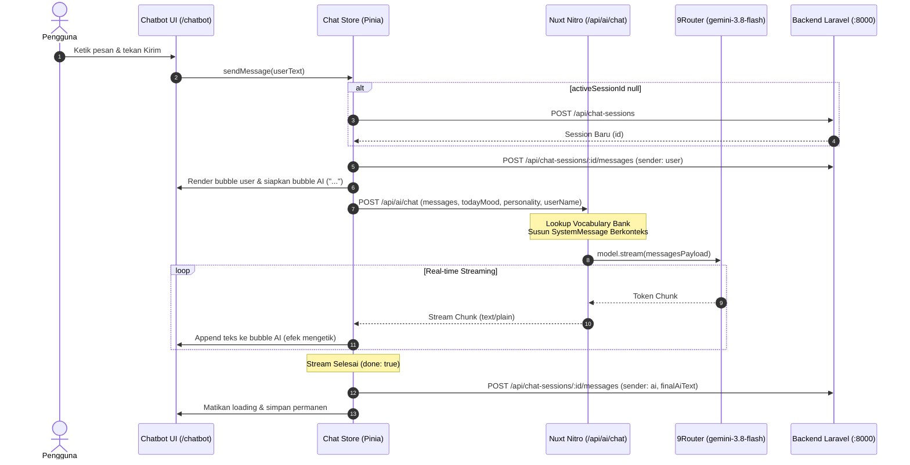

# Dokumentasi Serah Terima (Handover) Frontend PodoFriend

> **Target Pembaca:** Rekan Pengembang / Tim Teknis yang melanjutkan pengembangan Frontend.  
> **Aplikasi:** PodoFriend Frontend (Web App Pendamping Belajar & Pencegah Burnout).  
> **Teknologi Utama:** Nuxt 4 (v4.5.2), Vue 3, Tailwind CSS, Pinia, Nitro Server, LangChain.  
> **Tanggal Pembaruan Terakhir:** Oktober 2026.

---

## Daftar Isi
1. [Arsitektur & Tech Stack](#1-arsitektur--tech-stack)
2. [Konfigurasi Lingkungan (.env & nuxt.config.ts)](#2-konfigurasi-lingkungan-env--nuxtconfigts)
3. [Struktur Direktori Proyek](#3-struktur-direktori-proyek)
4. [Fitur-Fitur yang Telah Selesai Dibangun](#4-fitur-fitur-yang-telah-selesai-dibangun)
   - [Phase 1: Autentikasi & Fondasi UI](#phase-1-autentikasi--fondasi-ui)
   - [Phase 2: Pomodoro Timer, Gamifikasi & Survei Mood](#phase-2-pomodoro-timer-gamifikasi--survei-mood)
   - [Phase 3.1: Multi-Sesi Chatbot](#phase-31-multi-sesi-chatbot)
   - [Phase 3.2: Nitro Server Streaming & Vocabulary Bank](#phase-32-nitro-server-streaming--vocabulary-bank)
5. [Alur Komunikasi Data & API](#5-alur-komunikasi-data--api)
   - [Backend Utama (Laravel API)](#backend-utama-laravel-api)
   - [AI Gateway (9Router & Nitro Server)](#ai-gateway-9router--nitro-server)
6. [State Management (Pinia Stores)](#6-state-management-pinia-stores)
7. [Panduan Menjalankan & Menguji Proyek](#7-panduan-menjalankan--menguji-proyek)
8. [Catatan Kritis & Tips untuk Tim Selanjutnya](#8-catatan-kritis--tips-untuk-tim-selanjutnya)

---

## 1. Arsitektur & Tech Stack

Aplikasi dibangun di atas **Nuxt 4** dengan mode SSR/Hybrid dan Nitro Server:

| Layer | Teknologi | Keterangan |
|---|---|---|
| **Framework** | Nuxt `4.5.2` (Vue `3.5.43`) | Menggunakan struktur direktori Nuxt 4 (`app/` dan `server/`). |
| **Styling** | Tailwind CSS (`@nuxtjs/tailwindcss`) | Palette warna khusus: Warm Orange (`#F56A16`, `bg-orange-500`), Soft Cream (`#FFF7ED`, `#FBBE97`), Stone text. |
| **State Management** | Pinia (`@pinia/nuxt`) + Persistedstate | Mengelola Auth, Timer, Survei, Gamifikasi, Preferensi, dan Multi-Sesi Chat. |
| **Icons** | `@nuxt/icon` (Lucide Icons) | Menggunakan icon SVG modern (`lucide:*`), **tanpa emoji grafis**. |
| **Server Engine** | Nuxt Nitro Server | Berperan sebagai proxy AI gateway aman untuk streaming LangChain. |
| **AI LLM** | `@langchain/openai`, `@langchain/core` | Dieksekusi **eksklusif di sisi server Nitro** (tidak diekspos ke browser). |

---

## 2. Konfigurasi Lingkungan (.env & nuxt.config.ts)

### Berkas `.env` (Frontend)
```dotenv
# Endpoint Backend Laravel
NUXT_PUBLIC_API_BASE=http://localhost:8000

# Kredensial AI Gateway (9Router) - Server-Side Only
NUXT_AI_BASE_URL=https://your-9router-url/v1
NUXT_AI_API_KEY=your_9router_api_key_here
NUXT_AI_MODEL=gemini/gemini-3.8-flash
```

### Konfigurasi `runtimeConfig` di `nuxt.config.ts`
> [!IMPORTANT]
> **Keamanan Kredensial:** Variabel `aiBaseUrl`, `aiApiKey`, dan `aiModel` ditempatkan di tingkat atas `runtimeConfig` (**private**). Nilai-nilai ini **TIDAK PERNAH** dikirim ke browser atau terekspos di bundle client. Hanya `apiBase` yang ditempatkan di `runtimeConfig.public`.

---

## 3. Struktur Direktori Proyek

```text
frontend/
├── app/                           # Kode Aplikasi Client Vue 3
│   ├── assets/css/main.css        # Konfigurasi Tailwind & Global Styles
│   ├── components/                # Komponen Antarmuka Reusable
│   │   ├── AppMascot.vue          # Maskot SVG interaktif "Podo" (size: sm, md, lg, xl)
│   │   ├── MoodSurveyModal.vue    # Modal wajib survei mood harian
│   │   ├── PomodoroTimer.vue      # Timer fokus Pomodoro dengan kontrol siklus
│   │   └── chat/                  # Komponen Khusus Chatbot
│   │       ├── ChatBubble.vue     # Gelembung pesan (User oranye, AI abu-abu + avatar)
│   │       ├── ChatInput.vue      # Input teks, tombol kirim, quick suggestion prompts
│   │       ├── ChatPersonalityModal.vue # Modal pilihan persona AI
│   │       ├── ChatSidebar.vue    # Sidebar riwayat sesi (drawer mobile & list sesi)
│   │       └── ChatTypingIndicator.vue # Indikator berpikir (...)
│   ├── composables/               # Vue Composables
│   │   ├── useAiChat.ts           # Logika streaming fetch, konsumsi chunk, sinkronisasi Laravel
│   │   └── useApiFetch.ts         # Wrapper $fetch dengan auth token & auto redirect 401
│   ├── layouts/                   # Layout Halaman
│   │   ├── dashboard.vue          # Layout navigasi dashboard utama
│   │   └── default.vue            # Layout dasar
│   ├── pages/                     # Halaman Rute
│   │   ├── chatbot.vue            # Halaman utama full-screen obrolan multi-sesi
│   │   ├── chat.vue               # Rute alias (otomatis redirect ke /chatbot)
│   │   ├── dashboard.vue          # Dashboard timer fokus & ringkasan mood
│   │   ├── gamification/stats.vue # Statistik belajar, streak, & achievement
│   │   ├── login.vue              # Halaman masuk
│   │   ├── register.vue           # Halaman pendaftaran
│   │   └── timer.vue              # Tampilan timer alternatif
│   ├── stores/                    # Pinia Stores
│   │   ├── auth.ts                # State user & token login
│   │   ├── chat.ts                # Multi-sesi, daftar pesan, loading, & pencarian
│   │   ├── gamification.ts        # Point, exp, streak, & badge prestasi
│   │   ├── preferences.ts         # Preferensi kepribadian AI
│   │   ├── survey.ts              # Status survei mood hari ini
│   │   └── timer.ts               # Timer Pomodoro, durasi sesi, play/pause
│   └── types/                     # TypeScript Interfaces
│       ├── chat.ts                # Tipe pesan, sesi, & payload chat
│       ├── preferences.ts         # Tipe preferensi kepribadian
│       └── survey.ts              # Tipe data survei mood harian
├── collaboration_docs/            # Dokumentasi Serah Terima Proyek
├── server/                        # Nuxt Nitro Server (Backend for Frontend)
│   ├── api/ai/
│   │   └── chat.post.ts           # Endpoint Nitro LangChain streaming (POST /api/ai/chat)
│   └── utils/
│       └── vocabularyBank.ts      # Kamus emosi, analisis kosakata, & pencocokan vibe
├── nuxt.config.ts                 # Konfigurasi modul, CSS, & runtimeConfig
└── package.json                   # Dependensi & script pnpm
```

---

## 4. Fitur-Fitur yang Telah Selesai Dibangun

### Phase 1: Autentikasi & Fondasi UI
- **Pendaftaran & Masuk:** Form autentikasi responsif dengan validasi error dan feedback visual.
- **Token Management:** Token Bearer disimpan via Pinia Persistedstate dan disuntikkan otomatis pada setiap request API via `useApiFetch.ts`.
- **Protected Routes:** Bila token kedaluwarsa atau terjadi respons HTTP 401, sesi otomatis dibersihkan dan dialihkan ke `/login`.

### Phase 2: Pomodoro Timer, Gamifikasi & Survei Mood
- **Pomodoro Timer:**
  - Mode: *Focus* (25 menit), *Short Break* (5 menit), *Long Break* (15 menit).
  - Kontrol: Start, Pause, Reset, Skip.
  - Siklus otomatis dengan visualisasi progres melingkar.
- **Survei Mood Harian (`MoodSurveyModal.vue`):**
  - Opsi Mood: `Energetic`, `Balanced`, `Tired`, `Overwhelmed`, `Distracted`.
  - Jika pengguna belum mengisi mood hari ini, modal akan meminta pengguna memilih mood terlebih dahulu agar Podo dapat mendampingi sesuai kondisi mentalnya.
- **Gamifikasi (`gamification/stats.vue`):**
  - Perhitungan *Daily Streak*, total menit fokus, sesi selesai, dan status badge penghargaan.

### Phase 3.1: Multi-Sesi Chatbot
- **Arsitektur Multi-Sesi Penuh (`pages/chatbot.vue`):**
  - **Sidebar Kiri (`ChatSidebar.vue`):**
    - Tombol utama **"Chat Baru"** (`createSession()`).
    - Input pencarian sesi berdasarkan judul atau cuplikan percakapan.
    - Daftar sesi interaktif dengan sorotan visual pada sesi yang sedang aktif.
    - Pratinjau pesan terakhir dan stempel waktu (jam/hari).
    - Drawer geser (*sliding drawer*) untuk pengguna layar seluler (mobile).
  - **Area Chat Utama:**
    - Placeholder informatif saat `activeSessionId === null` ("Pilih atau mulai obrolan baru" dengan tombol CTA).
    - Desain Bubble:
      - **User Bubble:** Rata kanan, `bg-orange-500`, teks putih, sudut melengkung.
      - **AI Bubble:** Rata kiri, `bg-gray-100`, teks gelap, disertai avatar `AppMascot.vue` berukuran kecil.
    - Auto-scroll otomatis menggunakan `nextTick()` setiap kali ada teks atau pesan baru.

### Phase 3.2: Nitro Server Streaming & Vocabulary Bank
- **Eksekusi Server-Side LangChain:**
  - LangChain **tidak dijalankan di browser**. Frontend memanggil endpoint Nitro internal `POST /api/ai/chat`.
- **Text Streaming Real-Time:**
  - Endpoint Nitro mengembalikan data bertahap melalui `ReadableStream` (`sendStream()`).
  - Frontend membaca stream menggunakan `window.fetch` dan `response.body.getReader()`. Teks ditampilkan mengalir kata demi kata secara instan.
- **Injeksi Vocabulary Bank (`server/utils/vocabularyBank.ts`):**
  - Menyuntikkan pemetaan emosi (*vibe*, *keywords*, dan *label*) ke dalam `SystemMessage` LangChain berdasarkan mood harian (`todayMood`) dan gaya persona pengguna.
  - Mendeteksi *Positive Contradiction* (misalnya UI berstatus *Tired*, namun pengguna mengetik *"udah enakan, gas lanjut"*), sehingga AI langsung menyambut antusiasme baru pengguna.
  - Fallback otomatis ke status `Balanced` bila data survei mood belum diisi.
- **Model 9Router Teruji:**
  - Menggunakan model `gemini/gemini-3.8-flash` yang aktif dan stabil pada gateway 9router.
  - Terdapat mekanisme pengaman jika model upstream mengembalikan pesan penolakan (*"is no longer available"*), sistem otomatis mengalirkan pesan fallback ramah Podo.
- **Reaktivitas UI Error State:**
  - Jika terjadi kendala jaringan, animasi tiga titik (`...`) langsung digantikan teks error secara real-time tanpa perlu refresh halaman web.

---

## 5. Alur Komunikasi Data & API



### Endpoint Backend Laravel yang Digunakan
| Method | Endpoint | Fungsi |
|---|---|---|
| `GET` | `/api/chat-sessions` | Mengambil daftar riwayat sesi obrolan |
| `POST` | `/api/chat-sessions` | Membuat sesi baru |
| `GET` | `/api/chat-sessions/{id}/messages` | Mengambil pesan sesi tertentu (ascending) |
| `POST` | `/api/chat-sessions/{id}/messages` | Menyimpan pesan (user/ai) ke sesi |
| `GET` | `/api/surveys/today` | Mengambil status survei mood hari ini |
| `POST` | `/api/surveys/mood` | Menyimpan pilihan mood hari ini |
| `GET` | `/api/user/preferences` | Mengambil preferensi kepribadian AI |
| `PUT` | `/api/user/preferences` | Memperbarui gaya kepribadian AI |

---

## 6. State Management (Pinia Stores)

### `stores/chat.ts`
- **State:**
  - `sessions: ChatSession[]`: Daftar sesi obrolan.
  - `activeSessionId: string | number | null`: ID sesi yang sedang dibuka.
  - `messages: ChatMessage[]`: Daftar pesan pada sesi aktif.
  - `isLoading: boolean`: Status apakah AI sedang memproses/mengetik.
  - `isFetchingSessions: boolean` & `isFetchingMessages: boolean`: Status loading data.
  - `searchQuery: string`: Kata kunci filter pencarian riwayat.
- **Actions Kunci:**
  - `fetchSessions()`: Memuat riwayat sesi.
  - `createSession(title?)`: Membuat sesi baru dan mengosongkan array `messages`.
  - `fetchMessages(sessionId)`: Memuat pesan sesi terpilih.
  - `saveMessage(sender, message, sessionId?)`: Menyimpan pesan ke backend Laravel.
  - `updateAiMessage(id, text)`: Memperbarui teks pesan secara reaktif seketika.

### `stores/survey.ts`
- Mengatur modal survei mood harian (`showModal`, `todaySurvey`).
- `fetchTodaySurvey()`: Memeriksa apakah pengguna sudah mengisi mood hari ini.
- `submitMood(mood)`: Mengirim pilihan mood ke backend.

### `stores/preferences.ts`
- Mengatur gaya respon kepribadian AI:
  1. *Empatik & Mendukung* (Default)
  2. *Tegas & Disiplin*
  3. *Santai & Bersahabat*
  4. *Penyemangat & Energik*

---

## 7. Panduan Menjalankan & Menguji Proyek

### Prasyarat:
- Node.js versi 18+ atau 20+
- `pnpm` (disarankan)

### Menjalankan Development Server:
```bash
# Di direktori frontend:
pnpm install
pnpm dev
```
Aplikasi akan aktif di `http://localhost:3000`.

### Validasi & Kompilasi:
```bash
# 1. Pengecekan tipe TypeScript:
pnpm typecheck

# 2. Kompilasi build produksi:
pnpm build
```
Kedua perintah di atas harus menghasilkan **Exit Code 0** tanpa error.

---

## 8. Catatan Kritis & Tips untuk Tim Selanjutnya

1. **Jangan Mengekspos Kredensial AI:**
   - Semua pemanggilan LangChain / LLM **wajib** melalui rute Nitro (`server/api/`). Jangan pernah mengimpor `@langchain/openai` secara langsung di komponen Vue atau composables client.
2. **Aturan Format AI (No Emojis):**
   - Sesuai pedoman desain PodoFriend, maskot dan ekspresi diwakili oleh `AppMascot.vue` dan ikon Lucide. System prompt telah diprogram untuk melarang penggunaan emoji visual/grafis agar nada percakapan tetap profesional dan hangat.
3. **Penyimpanan Pesan AI Wajib Setelah Stream Selesai:**
   - Karena Nuxt Nitro bertindak murni sebagai generator streaming, penyimpanan pesan AI ke database Laravel dilakukan di sisi frontend pada blok penyelesaian stream (`useAiChat.ts`). Pastikan alur `chatStore.saveMessage('ai', fullAiText)` tetap dipanggil setelah `reader.read()` selesai (`done: true`).
4. **Pembaruan Vocabulary Bank:**
   - Jika ingin menambahkan kosakata gaul baru atau panduan mood baru, edit di [server/utils/vocabularyBank.ts](file:///d:/Data/Website%20Development/podo-friend/frontend/server/utils/vocabularyBank.ts). Fungsi ini secara otomatis terbaca oleh server route tanpa perlu restart konfigurasi.
5. **Dukungan Rute Lama:**
   - Tautan rute `/chat` sudah dikonfigurasikan untuk otomatis meneruskan pengguna ke `/chatbot`. Jangan menghapus `pages/chat.vue` agar tautan lama atau bookmark pengguna tidak mengalami 404.
